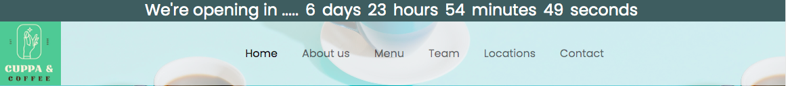
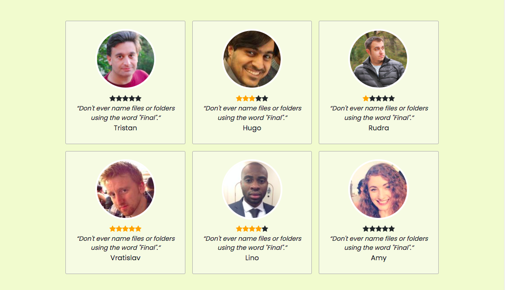
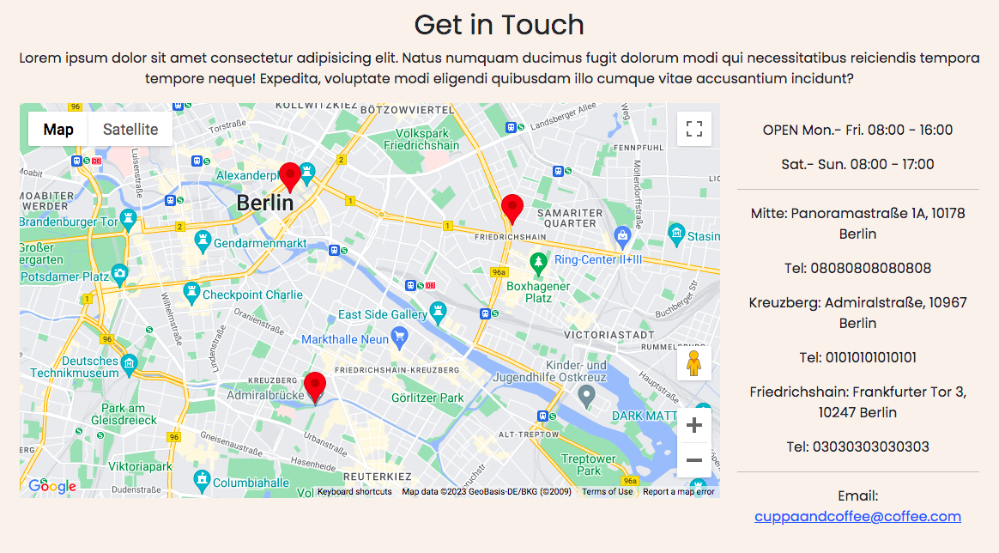
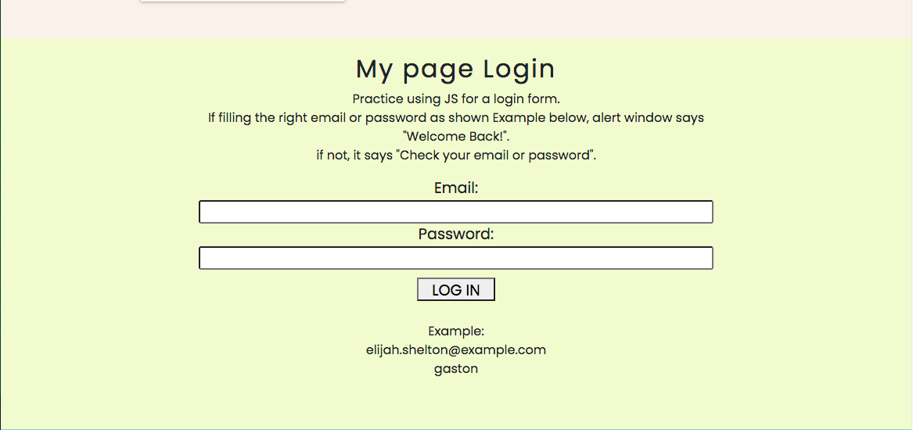
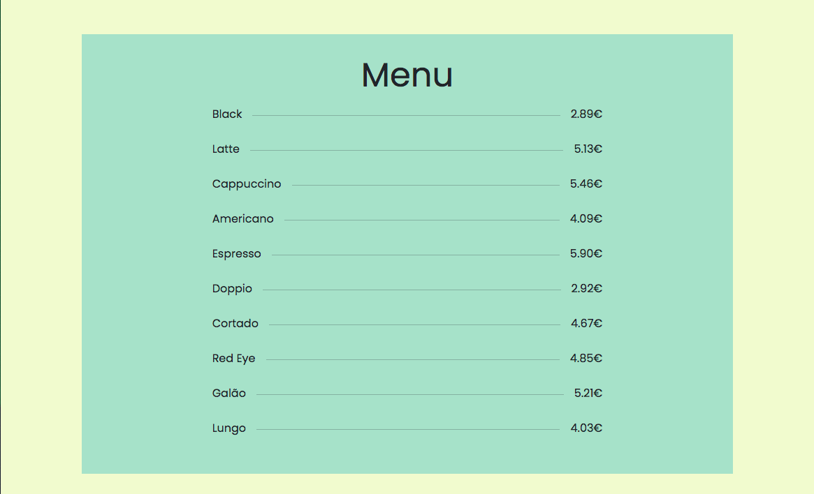

# Coffee shop website

First project for Frauenloop, which is a static website and using HTML, CSS, and JavaScript.
[DEMO](https://ayumi-ayumi.github.io/coffeeshop/)

## DEMO
---


"hoge"の魅力が直感的に伝えわるデモ動画や図解を載せる

It shows countdown time to the opening day.
When it counts down to 0, it added seven days and repeats.
-if condition
-setInterval()


The reviews are showed by using random user API.
The review rating stars are showed depending on the number from Math.random().
-random user API
-Math.random() 
-Font awesome
-Flexbox


The map shows three cafe locations.
-Google maps


This is a practice for fetching API and if conditon.
If you input the correct combination of Email and password, the alert windows says "Welcome Back!', if not, it shows "Check your email or password".


This is a practice for fetching API.
The drink items and price are fetched from API.

# Features

"hoge"のセールスポイントや差別化などを説明する

# Tools
* Font Awesome
* Unsplash
* Bootstrap
* API(https://randomuser.me/api/?results=10)
* API(https://api.sampleapis.com/coffee/hot)
* API(https://api.adviceslip.com/advice)
* CSS Section Separator Generator(https://wweb.dev/resources/css-separator-generator/)

# Installation

Requirementで列挙したライブラリなどのインストール方法を説明する

```bash
pip install huga_package
```

# Usage

DEMOの実行方法など、"hoge"の基本的な使い方を説明する

```bash
git clone https://github.com/hoge/~
cd examples
python demo.py
```

# Note

注意点などがあれば書く

# Author

作成情報を列挙する

* 作成者
* 所属
* E-mail

# License
ライセンスを明示する

"hoge" is under [MIT license](https://en.wikipedia.org/wiki/MIT_License).

社内向けなら社外秘であることを明示してる

"hoge" is Confidential.